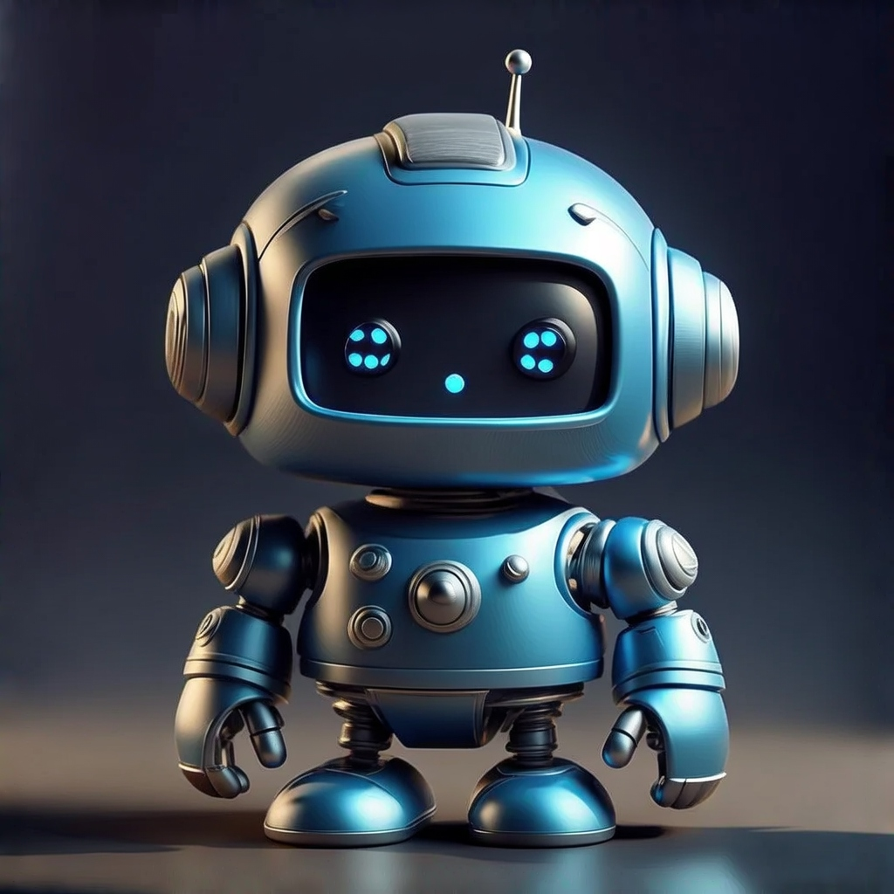

# 🎬 FIBO Continuity Engine

> **AI-Powered Multi-Frame Consistency for Characters, Products & Storyboards**

Built for the [BRIA FIBO Hackathon](https://bria-ai.devpost.com/) 

🔗 **[Live Demo](https://fibo-continuity-engine.vercel.app)** | 📽️ **[Demo Video](#)** | 🐙 **[GitHub](https://github.com/Abhishekgoyal007/FIBO-Continuity-Engine)**



---

## 🎯 The Problem

Every professional creative studio struggles with this challenge:

> *"How do we generate 5–20 shots of the SAME character with the exact same look, proportions, colors, and style from different camera angles?"*

Traditional AI models fail because each generation introduces **drift** in appearance, lighting, and proportions. This makes them unusable for:
- Game character turnarounds
- Product 360° views
- Animation storyboards
- Marketing asset consistency

---

## 💡 Our Solution: FIBO Continuity Engine

We leverage **BRIA FIBO's unique capabilities** to solve multi-frame consistency:

### 🔑 How We Use BRIA FIBO

| FIBO Feature | Our Implementation |
|--------------|-------------------|
| **Structured Prompts** | Capture character DNA from first generation, reuse for all subsequent shots |
| **Camera Angle Control** | Precise degree-based rotation (0°, 45°, 90°, 135°, 180°, etc.) |
| **Lighting Control** | Consistent lighting direction across all frames |
| **Color Palette** | Locked color schemes for visual consistency |
| **Disentangled Generation** | Change ONLY camera angle, keep everything else identical |
| **Seed Locking** | Same seed ensures deterministic, reproducible results |

### 🧠 Technical Integration

```typescript
// First shot: Generate with full prompt, get structured_prompt back
const firstShot = await fibo.generate(fullPrompt, seed);
const structuredPrompt = firstShot.structured_prompt; // Character DNA

// Subsequent shots: Modify ONLY camera angle in structured_prompt
for (const shot of remainingShots) {
    structuredPrompt.camera.angle = shot.cameraAngle;
    const result = await fibo.generate(cameraInstruction, seed, structuredPrompt);
}
```

---

## ✨ Key Features

### 🎥 Shot Planner with Templates
- **Character Turnaround** (5 shots: Front, 45°, Side, 135°, Back)
- **Product 360°** (8 shots at 45° intervals)
- **Storyboard Sequence** (6 cinematic compositions)
- **Expression Sheet** (9 emotional expressions)

### 📐 Precise Camera Controls
- Horizontal angle: 0° to 360° rotation
- Vertical angle: Bird's eye to worm's eye
- Field of View: Wide (24mm) to Telephoto (85mm)

### 🎨 Style Presets
- Visual styles: Photorealistic, Cinematic, Anime, Concept Art, 3D Render, Product
- Lighting: Studio, Natural, Dramatic, Rembrandt, Backlit
- Color palettes: Warm, Cool, Vibrant, Muted, Monochrome

### ✅ Consistency Analysis
- Real-time color histogram comparison
- Brightness and contrast matching
- Production-ready score indicator

### 📦 Export Options
- Individual frames (PNG/JPEG/WebP)
- Complete sequence as ZIP
- Animated GIF preview
- Full-resolution download

---

## 🚀 Quick Start

### Prerequisites
- Node.js 18+
- BRIA API Key ([Get one here](https://bria.ai))

### Installation

```bash
# Clone the repository
git clone https://github.com/Abhishekgoyal007/FIBO-Continuity-Engine.git
cd FIBO-Continuity-Engine

# Install dependencies
npm install

# Start development server
npm run dev
```

### Usage

1. **Enter API key** in Settings (⚙️ icon)
2. **Describe your subject** (character, product, scene)
3. **Choose a shot template** or customize angles
4. **Click "Generate"** and watch consistent frames appear!

---

## 🛠️ Tech Stack

| Technology | Purpose |
|------------|---------|
| **React 18 + TypeScript** | Frontend framework |
| **Vite** | Fast build tool |
| **Zustand** | State management |
| **Framer Motion** | Smooth animations |
| **BRIA FIBO API** | AI image generation |
| **JSZip + FileSaver** | Export functionality |

---

## 🏆 Hackathon Category

### **Best New User Experience or Professional Tool** 🎯

This project demonstrates:
- ✅ **Practical production application** for real creative workflows
- ✅ **Pro-grade controls** (camera angle, FOV, lighting, color palette)
- ✅ **Disentanglement** to change view without affecting identity
- ✅ **Professional UI/UX** designed for studio pipelines

### FIBO Features Showcased:
1. **Structured Prompts** - JSON-native generation control
2. **Camera Parameters** - Precise angle control
3. **Seed Locking** - Deterministic generation
4. **Iterative Refinement** - Modify single parameters while keeping others fixed

---

## 📸 Screenshots

### Landing Page
Premium design with animated hero section showcasing real FIBO-generated images.

### Main Application
Three-panel workflow:
- **Left**: Subject description + style settings
- **Center**: Shot planner with templates
- **Right**: Generated gallery with export

### Consistency Analysis
Real-time scoring with color histogram comparison.

---

## 🔮 Future Roadmap

- [ ] Reference image upload for image-to-image generation
- [ ] Batch export with custom naming
- [ ] Animation timeline editor
- [ ] Cloud project saving
- [ ] Team collaboration features

---

## 👨‍💻 Author

**Abhishek Goyal**
- GitHub: [@Abhishekgoyal007](https://github.com/Abhishekgoyal007)

---

## 📄 License

MIT License - Built for BRIA FIBO Hackathon 2025

---

<div align="center">

**Made with ❤️ for the BRIA FIBO Hackathon**

*Powered by [BRIA FIBO](https://huggingface.co/briaai/FIBO) - The first JSON-native text-to-image model*

</div>
